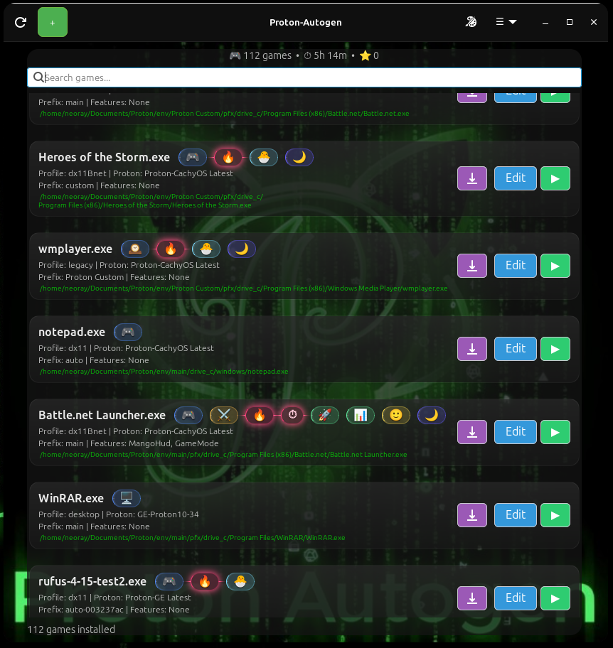

# 🧩 Proton-Autogen


A lightweight Linux tool that automatically runs Windows .exe files using Proton or Wine, with automatic fallback, GPU detection, and per-game configuration profiles.

Works as a simple wrapper between your .exe files and Proton — no manual setup required.


**A Proton/Wine orchestration layer for running Windows applications on Linux**

**Automatic Linux gaming environment configurator**


Run Windows executables through Proton with zero Steam configuration.
---
🎬 Quick Demo
<p align="left">
  
  
</p>


## 🚀 Overview

Proton-Autogen is a lightweight Linux utility.
Automatic Windows .exe execution system for Linux using Proton + Wine fallback

Instead of manually creating Steam shortcuts, configuring compatibility options, or managing Wine prefixes, simply:

* Right-click a `.exe`
* Select **Open with Proton-Autogen**
* Launch the application

The tool automatically detects available Proton installations (GE-Proton preferred), configures the runtime environment, and falls back to Wine when necessary.

---

## ✨ Features

* ▶ Run Windows `.exe` files directly via Proton
* 🧠 Automatic Proton detection
* 🚀 Proton-CachyOS and GE-Proton support
* 🍷 Automatic Wine fallback
* 🖱️ File manager integration

  * Nemo, Nautilus, Dolphin
* ⚙️ Optional GameMode support
* 📦 Debian package (.deb)
* 💻 Command-line interface
* 🔧 Lightweight and dependency-minimal

---

## 📸 Screenshots

### Integration


Right-click any Windows executable and select:

```text
Open with Proton-Autogen
```

---

## 🧪 Usage

### Terminal

```bash
proton-autogen game.exe
```

or

```bash
proton-autogen /path/to/application.exe
```

### Example Output

```text
$ proton-autogen 'Battle.net Launcher.exe'

[proton-autogen] System information:
  gpu: amd
  wayland: False
  steam_deck: False
  desktop: x-cinnamon
[info] proton-autogen: mangohud: True | gamemode: True | xalia: None | gpu: balanced
[proton-autogen] Runtime information
  Executable : /home/neoray/Documents/Proton/env/main/pfx/drive_c/Program Files (x86)/Battle.net/Battle.net Launcher.exe
  Proton     : Proton-CachyOS Latest
  Path       : /home/neoray/.local/share/Steam/compatibilitytools.d/Proton-CachyOS Latest
  proton-call: detected
  GameMode  : available
  MangoHud  : available

[info] proton-autogen: LOAD CONFIG PREFIX : main
[info] INFO: EXE architecture: 32bit
[proton-autogen] INIT PROFILE - type: dx11Bnet
[proton-autogen] PROFILE: DX11 Battle.net
[proton-autogen] SYNC: MANGOHUD=1 MANGOHUD_DLSYM=1
[proton-autogen] Apply PROFILE=DX11BNET | SYNC=OFF | WINED3D=OFF | XALIA=OFF | DXVK_HUD=OFF
[info] Prefix mode: Prefix mode : main
[info] Prefix path: Prefix path : /home/neoray/Documents/Proton/env/main
[proton-autogen] 32-bit legacy game detected
[proton-autogen] MangoHud 32-bit shim missing
[proton-autogen] Launch mode: Proton
```

---

## 📦 Installation & Update Linux (Debian/Fedora/Arch)
AUR package for proton-autogen.

## Install (AUR)

paru -S proton-autogen

## Manual build

makepkg -si

### (install manual)

```bash
git clone https://github.com/N3oRay/proton-autogen.git
cd proton-autogen
chmod +x install.sh
./install.sh
```
### (update manual)
```bash
cd proton-autogen
git pull
chmod +x update.sh
./update.sh
```
## 📦 Installation & Update - Debian / Ubuntu

### Manual build  and install

```bash
git clone https://github.com/N3oRay/proton-autogen.git
cd proton-autogen
dpkg-buildpackage -b -us -uc
sudo dpkg -i ../proton-autogen_*.deb
```

### Ubuntu (Linux Mint, Pop!_OS) (install only)

```bash
sudo add-apt-repository ppa:n3oray/proton-autogen
sudo apt update
sudo apt install proton-autogen
```
### Config
The configuration is fully automatic.
```bash
cat ~/.config/proton-autogen.conf
ls ~/.config/proton-autogen/games
```


This installs:

* `/usr/bin/proton-autogen`
* Integrated with Nemo (Cinnamon), Nautilus (GNOME), and Dolphin (KDE Plasma).

---


## ⚠️ Requirements

### Required

* Python 3.x
* A working Proton installation

Supported locations:

```text
~/.steam/root/compatibilitytools.d
~/.steam/debian-installation/compatibilitytools.d
~/.local/share/Steam/compatibilitytools.d
```

### Optional
```
sudo apt install gamemode mangohud
```
* GameMode
* MangoHud
* Proton-CachyOS or GE-Proton
* ProtonUp-Qt

---

## 🧠 How It Works

1. Detect available Proton installations
2. Prefer GE-Proton when available
3. Launch executable through Proton
4. Fall back to Wine if Proton runtime tools are unavailable
5. Optionally enable GameMode

No Steam shortcut creation is required.

---

## 🗑️ Uninstallation

### Remove Package

```bash
sudo apt remove proton-autogen
```

### Full Cleanup

```bash
sudo apt purge proton-autogen
```

### Manual Cleanup

```bash
rm -rf ~/.config/proton-autogen
rm -f ~/.local/share/nemo/actions/proton-autogen.nemo_action
```

Restart Nemo:

```bash
nemo -q
```

Restart Nautilus:

```bash
nautilus -q
```

---

## 🚧 Known Limitations

* Not every Windows application works under Proton
* Some launchers require additional configuration
* Proton compatibility depends on the selected Proton version
* Certain applications may still require Wine tweaks

---

## 🛣️ Roadmap

* [x] Per-application profiles
* [x] Advanced prefix control (Steam compatdata integration)
* [x] Configuration file support
* [x] Game / Installer auto-detection
* [x] GUI frontend
* [x] Lutris integration
* [x] Sensors and MangoHud Help
* [ ] GameScope integration
* [ ] Winetricks integration
* [ ] ProtonDB integration
* [ ] Bottles integration
* [ ] Silent mode

---

## 💡 Philosophy

Linux gaming is powerful but often fragmented.

Proton-Autogen aims to reduce friction by turning Proton into a transparent execution layer rather than a manually configured tool.

The goal is simple:

> Right-click → Run Windows application → It just works.

---

## 👤 Author

**N3oray**


GitHub: https://github.com/N3oRay

---

## 📜 License

This project is licensed under the MIT License.

See the `LICENSE` file for details.
