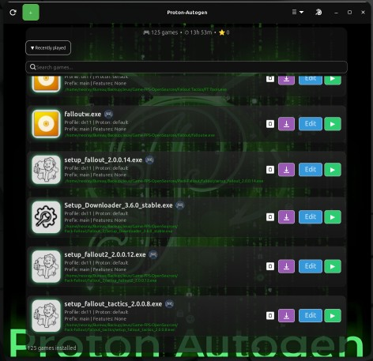
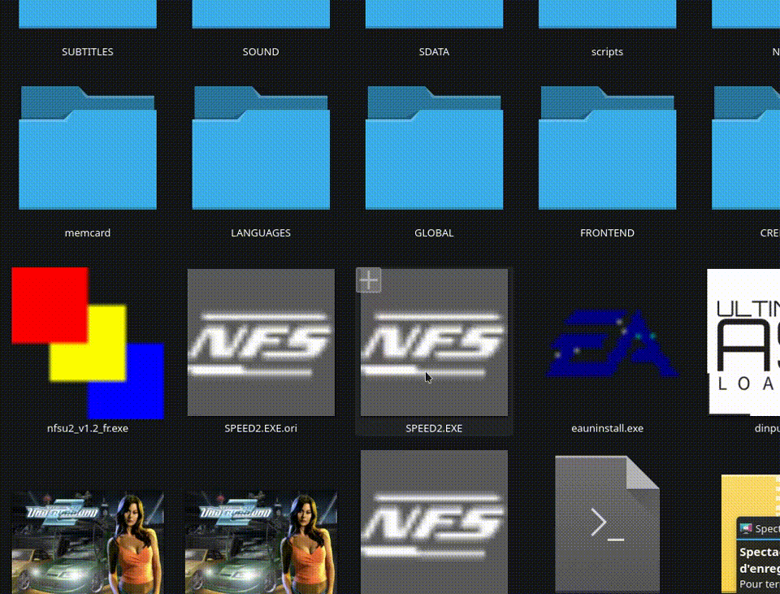

# 🧩 Proton-Autogen


**Proton-Autogen is a lightweight Proton/Wine orchestration layer that allows Linux users to run Windows applications directly from .exe files without manually configuring Steam shortcuts or Wine prefixes.**


Run Windows executables through Proton with zero Steam configuration.
---
🎬 Quick Demo
<p align="left">
  
  
</p>


## 🚀 Overview

Proton-Autogen automatically detects available Proton installations, configures the required runtime environment, and launches Windows applications using Proton with Wine fallback support.

No manual Steam shortcut creation or prefix configuration is required.

Simply:

* Right-click a `.exe`
* Select **Open with Proton-Autogen**
* Launch the application

---

## ✨ Features

* ▶ Run Windows `.exe` files directly via Proton
* 🧠 Automatic Proton detection
* 🚀 Proton-CachyOS and GE-Proton support
* 🍷 Wine fallback support
* 📦 Prefix management
* 🖱️ File manager integration : Nemo, Nautilus, Dolphin
* 🎮 Game/application profiles
* 🖥️ GTK4 graphical interface
* 🛠️ Diagnostic tools
* ⚙️ CLI and advanced options
* 🔧 Lightweight and dependency-minimal

See an example of generated profiles here: [Profile Output Example](docs/profiles.md)

---

## 📸 Screenshots


### Integration
Right-click any Windows executable and select:

```text
Open with Proton-Autogen
```

---

## 🧪 Usage

### Terminal

```bash
proton-autogen game.exe
```

### Graphical interface:

```bash
proton-autogen --ux
```

### Example Output: 
See the full example output here: [Example Output](docs/examples.md)


---
## 📦 Downloads

Latest releases are available on GitHub:

- Debian / Ubuntu: `.deb` package
- Source installation: `install.sh`
- Arch Linux / CachyOS: AUR (coming soon)

## 📦 Installation & Update Linux (Debian/Fedora/Arch)
AUR package coming soon.

See the manual installation guide:
[Installation Guide](docs/install.md)

### (install manual)

```bash
git clone https://github.com/N3oRay/proton-autogen.git
cd proton-autogen
chmod +x install.sh
./install.sh
```

## 📦 Installation & Update - Debian / Ubuntu

### Manual build  and install

```bash
git clone https://github.com/N3oRay/proton-autogen.git
cd proton-autogen
dpkg-buildpackage -b -us -uc
sudo dpkg -i ../proton-autogen_*.deb
```

### Ubuntu (Linux Mint, Pop!_OS) (install only)

```bash
sudo add-apt-repository ppa:n3oray/proton-autogen
sudo apt update
sudo apt install proton-autogen
```
### Config
The configuration is fully automatic.
```bash
cat ~/.config/proton-autogen.conf
ls ~/.config/proton-autogen/games
```


This installs:

* `/usr/bin/proton-autogen`
* Integrated with Nemo (Cinnamon), Nautilus (GNOME), and Dolphin (KDE Plasma).

---

## ⚠️ Requirements

### Required

* Python 3.x
* A working Proton installation

Supported locations:

```text
~/.steam/root/compatibilitytools.d
~/.steam/debian-installation/compatibilitytools.d
~/.local/share/Steam/compatibilitytools.d
```

### Optional

- GameMode
- MangoHud
- Proton-CachyOS
- GE-Proton
- ProtonUp-Qt
```bash
sudo apt install gamemode mangohud
```
---

## 🧠 How It Works

1. Detect available Proton installations
2. Prefer GE-Proton when available
3. Launch executable through Proton
4. Fall back to Wine if Proton runtime tools are unavailable
5. Optionally enable GameMode

No Steam shortcut creation is required.

---

## 🗑️ Uninstallation

### Remove Package

```bash
sudo apt remove proton-autogen
```

### Full Cleanup

```bash
sudo apt purge proton-autogen
```

### Manual Cleanup

```bash
rm -rf ~/.config/proton-autogen
rm -f ~/.local/share/nemo/actions/proton-autogen.nemo_action
```

Restart Nemo:

```bash
nemo -q
```

Restart Nautilus:

```bash
nautilus -q
```

---

## 🚧 Known Limitations

* Not every Windows application works under Proton
* Some launchers require additional configuration
* Proton compatibility depends on the selected Proton version
* Certain applications may still require Wine tweaks

---

## 🛣️ Roadmap

* [x] Per-application profiles
* [x] Advanced prefix control (Steam compatdata integration)
* [x] Configuration file support
* [x] Game / Installer auto-detection
* [x] GUI frontend
* [x] Lutris integration
* [x] Sensors and MangoHud Help
* [ ] GameScope integration
* [ ] Winetricks integration
* [ ] ProtonDB integration
* [ ] Bottles integration
* [ ] Silent mode

---

## 🤝 Contributing

Bug reports, feature requests, and contributions are welcome.

Please use GitHub Issues for discussions and reports.


## 💡 Philosophy

Linux gaming is powerful but often fragmented.

Proton-Autogen aims to reduce friction by turning Proton into a transparent execution layer rather than a manually configured tool.

The goal is simple:

> Right-click → Run Windows application → It just works.

---

## 👤 Author

**N3oray**


GitHub: [@N3oRay](https://github.com/N3oRay)

---

## 📜 License

This project is licensed under the MIT License.

See the `LICENSE` file for details.

## 📈 GitHub Traffic
```markdown
📦 Clones             ████████████████████  1,348
👥 Unique cloners     ██████                374
👀 Views              █████                 351
🌍 Unique visitors    ██                    159
